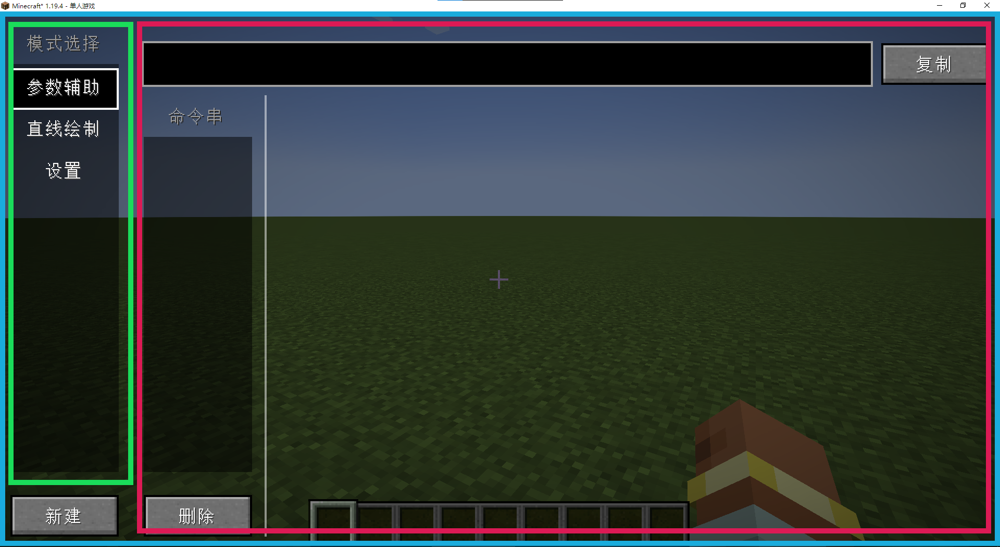

# GUI

当你想要用户不只是对着方块左键右键就完成互动的时候，就会需要游戏内用户界面。与其他教程可能略有不同，我们将使用T88的GUI部分来完成GUI编写。

:::info

如果你更想要使用原版GUI进行编写，或是想要了解原版GUI的原理，你可以查看[Fledge的Boson教程](https://boson.v2mcdev.com/gui/intro.html)。

:::

由于MC原版GUI代码实在是不怎么简便，故开发者们通常更喜欢使用一些GUI库。但是有一个不一定准确，又有点不幸的印象是，Forge模组的开发者往往更倾向于造一个自己的GUI轮子——T88亦是如此。

总体来讲，T88（的GUI部分）是一个对原版GUI的简单抽象层、倾向于原版美术风格、代码结构类似Swing。作为抽象层，跨版本兼容性也是T88的追求之一，尽力减少在版本变化时所需的代码改动。

:::info

- 如果你想要更加炫酷和专业的界面，你可以考虑BCL的[ModernUI](https://github.com/BloCamLimb/ModernUI)。

:::

:::tip

目前T88的组件功能并不十分完善。欢迎你提交自己的新组件。

:::

由是否直接含有ItemStack区分，GUI可以被分为container-GUI和non-container-GUI。前者通常需要涉及到物品的两端同步问题而略微复杂，我们讲先从后者开始讲起；由GUI展示时机区分，有以Screen为代表的世界外GUI（例如暂停菜单）和抬头显示HUD（例如血条和盔甲条），以下的“GUI”默认都指前者。

---

:::tip

T88的有关内容随版本可能有变化但未及时在此处更新，请自行注意。

:::

## non-container-GUI

:::caution

请注意，GUI只在客户端存在。

:::

### 地基：自定义TScreen

简单来讲，GUI各组件就是有不同渲染方法和响应方法的类。他们需要最终依附于一个`Screen`， 在其统筹之下进行渲染和响应。

要展示你的GUI，你需要一个自己的Screen类。我们将以MadParticle的辅助设计工具`DesignerScreen`为例进行讲解，其大体结构如图：



蓝色框即为这一整个Screen，里面是一个典型的卡片结构：在左侧`DesignerModeSelectList`选择想要看到的是`HelperModePanel`、`LineModePanel`、还是`SettingPanel`。

以下`DesignerScreen`代码均为GPLv3许可。

```java
public class DesignerScreen extends TScreen {
    public static final int GAP = 5;
    private static DesignerScreen designerScreen = null;

    private final DesignerModeSelectList designerModeSelectList = new DesignerModeSelectList();

    private final HelperModePanel helperModePanel = new HelperModePanel();
    private final LineModePanel lineModePanel = new LineModePanel();
    private final SettingPanel settingPanel = new SettingPanel();

    public DesignerScreen() {
        super(Component.translatable("gui.mp.designer.title"));
        this.add(designerModeSelectList);
        this.add(helperModePanel);
        this.add(lineModePanel);
        this.add(settingPanel);
        if (designerScreen == null) {
            designerScreen = this;
        }
    }
...
```

首先你需要继承`TScreen`来创建你自己的类。`TScreen`的构造函数会要求你填入一个`title`，它在多数情况下没有实用意义，填写只是为了备用。

然后实例化你需要的组件，用`add(TWidget tWidget)`方法来添加进`DesignerScreen`中。当`TScreen`需要渲染、触发、或是tick时，它会自动地触发`tChildren`中组件的对应方法。

:::info

在构造函数中add或是单独写一个init方法都是可行的，建议根据具体内容多少来决定。

`Twidget`是T88所有GUI组件的通用接口。查看其源代码以了解所有功能。

没错，T88的所有组件类都是以T打头的，其中一些方法为了和原版进行区分，也是以T结尾的。

:::


```java
    public static @Nullable DesignerScreen getInstance() {
        return designerScreen;
    }

    public static DesignerScreen newInstance() {
        if (designerScreen != null) {
            designerScreen.onClose(true);
        }
        designerScreen = new DesignerScreen();
        return designerScreen;
    }
```

显然，`DesignerScreen`适合使用单例模式。这里与GUI本身关系不大，你可以忽略这一段。


```java
    @Override
    public void layout() {
        designerModeSelectList.setBounds(GAP, GAP,
                TButton.RECOMMEND_SIZE.x + designerModeSelectList.getComponent().getScrollbarGap() + TSelectList.SCROLLBAR_WIDTH,
                height - GAP * 4 - 1 - 20);
        LayoutHelper.BRightOfA(helperModePanel, GAP + 1, designerModeSelectList,
                width - designerModeSelectList.getWidth() - 3 * GAP - 1,
                height - 2 * GAP);
        LayoutHelper.BSameAsA(lineModePanel, helperModePanel);
        LayoutHelper.BSameAsA(settingPanel, lineModePanel);
        super.layout();
        designerModeSelectList.getComponent().setSelected(designerModeSelectList.getComponent().getSelected());
    }
```

不论是你自己的`TScreen`还是`TWidget`，你都需要在`layout`方法中对所有子组件进行布局。

- `Twidget#setBounds(int x, int y, int width, int height)`以相对坐标指定组件左上角的位置——就像Swing一样。不过和Swing不同的是，这个方法本质上只是帮你换算了一下而已，组件字段中的`x`和`y`还是绝对坐标。
- `Twidget#setAbsBounds(int x, int y, int width, int height)`以绝对坐标指定组件左上角的位置。
- `LayoutHelper`中有许多帮助你相对指定组件位置的方法。

不同状况下你的`x`/`y`, `width`/`height`的来源不尽相同。

- 你需要根据实际情况决定使用固定绝对值（例如直接填个100）还是相对值（例如`width/10`）。
- 一些类可能提供合适的`getPreferredSize`以供直接使用。
- `LayoutHelper`中的一些方法会直接复制参考组件的大小。

:::tip

`getPreferredSize`并不总是有效，这个方法的主要设计目的是减少重复编码和推荐某个大小，并不一定在所有子类中都得到了适当的重写，你需要检查对应类的源码。

:::

最后，记得把`super.layout();`放在最后一行来调用子组件的相关方法。

`designerModeSelectList.getComponent().setSelected(designerModeSelectList.getComponent().getSelected());`这一句你可以忽略。

```java
    public void setVisibleMode(DesignerModeSelectList.DesignerMode mode) {
        TPanel[] panels = {helperModePanel, lineModePanel, settingPanel};
        Arrays.stream(panels).forEach(p -> p.setVisibleT(false));
        switch (mode) {
            case HELPER -> helperModePanel.setVisibleT(true);
            case LINE -> lineModePanel.setVisibleT(true);
            case SETTING -> settingPanel.setVisibleT(true);
            default -> {
            }
        }
    }
```

既然是卡片布局，那当然需要一个方法来控制组件的显示与否。有关`SelectList`的更多信息会在后面讲到。

```java
    @Override
    protected void renderBackGround(PoseStack pPoseStack, int pMouseX, int pMouseY, float pPartialTick) {
        fill(pPoseStack, 0, 0, width, height, 0x80000000);
    }
}
```

重写`renderBackGround`来设置一个经典的半透明黑色背景。

Screen写好了！要想打开这个Screen，你有三种途径：

- `Minecraft#setScreen`是最基础的方式，直接清除掉旧有的Screen并打开新的Screen。
- `ForgeHooksClient#pushGuiLayer`在旧有的Screen基础上叠加一层新的Screen。
- T88将会提供一个ScreenManager。

依据你打开方式的不同，你可能需要重写`onClose(boolean isFinal)`方法来调用对应的退出方法。

### 砖瓦：自定义TPanel

在刚刚的过程中你可能已经发现了一个问题：你既没有`DesignerModeSelectList`，也没有`HelperModePanel`和其他的东西？

T88内置了一些基础的组件。有些时候为了复用或是布局方便，你需要自行组装一个TPanel来使用。

:::info

各基础组件的用法可以在左侧的子章节中查看。

:::

我们以`TTitledComponent`为例，顾名思义，这个组件给其他组件加上了一个标题。这个类最早来源于MadParticle，后来被移植到T88，GPLv3：

```java
public abstract class TTitledComponent<T extends TWidget> extends TPanel {
    protected final TLabel title = new TLabel();
    protected final T widget;
    int gap = 0;
    int labelHeight = 12;

    public TTitledComponent(Component titleText, T component) {
        widget = component;
        title.setText(titleText);
        title.setHorizontalAlignment(HorizontalAlignment.LEFT);
        title.setBounds(0,0,0,labelHeight);
        title.setForeground(0xff9e9e9e);
        this.add(title);
        this.add(widget);
    }

    @Override
    public void layout() {
        defaultLayout();
        super.layout();
    }

    public void defaultLayout() {
        title.setBounds(0, 0, width, labelHeight);
        LayoutHelper.BBottomOfA(widget, gap, title, width, height - title.getHeight() - gap);
    }

    @Override
    public Vec2i getPreferredSize() {
        return new Vec2i(Math.max(title.getWidth(), widget.getSize().x),
                title.getHeight() + widget.getSize().y
        );
    }

    public int getGap() {
        return gap;
    }

    public void setGap(int gap) {
        this.gap = gap;
    }

    public TLabel getTitle() {
        return title;
    }

    public T getComponent() {
        return widget;
    }

    public int getLabelHeight() {
        return labelHeight;
    }

    public void setLabelHeight(int labelHeight) {
        this.labelHeight = labelHeight;
    }
}
```

所有的自定义组件都继承于TPanel。

就像编写Screen一样，我们实例化并添加子组件，设置需要的默认值，在`layout`中排好布局，重写`getPreferredSize`，加上需要的getter和setter，齐活！

:::info

- 如果你需要执行一些循环逻辑，重写`tickT`即可。记得把`super.tickT();`放在最后一行。

- 如果子组件出了什么问题，不响应或者不渲染，检查检查你是不是在重写某个方法的时候忘了super方法。

- 随着你编写的GUI越来越多，你可能会遇到这种尴尬的写法：`((GrandFatherClass)((FatherClass)this.getParent()).getParent()).something()`。你可以使用`TWidget#getParentInstanceOf`来取代之。

- 如果你的组件在滚动时有什么问题，检查你是不是忘记在某个与什么坐标相关的地方加上`TWidget#getParentScrollAmountIfExist`。

- 与Swing不同，子组件的位置并没有严格限制——因此你可以越界渲染。

- 你并不需要对每个略有改动的组件都单独建个类，我个人的推荐是：如果只是某些简单行为上的更改，使用匿名内部类就可以了；如果只是一些组装以便布局，内部类也是可以的；当修改较多时再使用外部独立类。

:::

---

## container-GUI


---

## HUD

与GUI略有不同，你的各个组件没有Screen可依靠了，需要一个TPanel假装Screen来装下子组件和布局。

新TPanel的编写与以往没什么两样，除了你需要重写`resizeAsHud`方法：

```java
    @Override
    public void resizeAsHud(int screenWidth, int screenHeight) {
        this.setAbsBounds((screenWidth - 216) / 2, 0, 216, 18);
        super.resizeAsHud(screenWidth, screenHeight);
    }
```

使用`this.setAbsBounds`来自己指定自己的绝对位置和大小即可。

:::info

在此处也可以使用`setBounds`，当`parent`字段为空时与`setAbsBounds`是等效的。但是从语义上我更推荐你使用`setAbsBounds`。

:::

然后你只需要在合适的时机调用`HudManager#add`，你的HUD就会在合适的时机（通常是下一个tick）被加入到游戏中。记得留个指针以便在合适的时候`remove`。

:::info

作为备用方法，你也可以使用`HudManager#getChildren`来翻翻找找，但显然这是不太推荐的。

所有的HUD默认都将在玩家退出世界时清除。

:::
