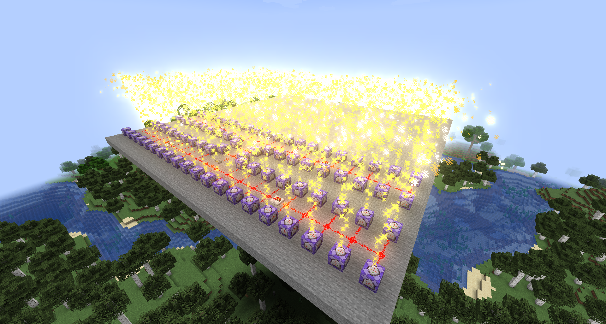

# 在服务器中使用MadParticle

为防止普通玩家随意使用而导致卡顿，`/madparticle`和`/mp`指令的执行权限为2级。

---

我了解您作为服主或管理员对服务器性能的担忧。

在MadParticle Forge 0.2.0（Fabric 0.1.0）版本之后，对`/madparticle`和`/mp`命令的解析均以异步方式执行，这在多数情况下减少了对主线程的干扰。但如果您的服务器只有1个核心，那可能会存在一些极其轻微的负面影响。

## /madparticle性能测试

在接下来的性能测试中，我们使用这条命令作为测试例。其含有2个子粒子，适合用来代表一般情况：

```
madparticle minecraft:crit RANDOM 30 FALSE 1 ~ ~1 ~ 0.0 0.0 0.0 0.0 0.45 0.0 0.05 0.05 0.05 FALSE 0 0 0 0.97 0.97 0.15 0.15 0 0 0 0 0.0 TRUE 0 0 PARTICLE_SHEET_TRANSLUCENT 0.996 0.801 0.318 1.0 1.0 1 LINEAR 1 1 LINEAR @a expireThen minecraft:cloud RANDOM 40 FALSE 1 = = = 0.0 0.0 0.0 0.0 0.0 0.0 0.08 0.0 0.08 FALSE 0 0 0 0.97 0.97 0.0 0.0 0 0 0 0 0.0 TRUE 0 0 PARTICLE_SHEET_TRANSLUCENT 0.996 0.733 0.216 1.0 1 0.6 LINEAR 1 1 LINEAR @a expireThen minecraft:cloud RANDOM 20 FALSE 1 = = = 0.0 0.0 0.0 = = = 0.0 0.0 0.0 FALSE 0 0 0 0.96 0.96 0.0 0.0 0 0 0 0 0.0 TRUE 0 0 PARTICLE_SHEET_TRANSLUCENT 0.996 0.860 0.725 1.0 1.0 1 LINEAR 1 1 LINEAR @a
```

其效果如下图：



80个循环型命令方块工作引起的额外mspt消耗约为13ms，平均每个循环型命令方块的mspt消耗为0.1625ms。

## /mp性能测试

`/mp`使用经过简化的指令执行步骤，跳过了常规的指令解析工作。

使用同样的命令，80个循环型命令方块工作引起的额外mspt消耗约为4.5ms，平均每个循环型命令方块的mspt消耗为0.05625ms，是`/madparticle`消耗的约三分之一。

:::caution

以上性能测试数据仅供参考。使用的服务端为开发环境下的Forge原生服务端。CPU为AMD Ryzen 7 5800X，频率4.65GHz，内存频率3200MHz。在不同的服务器环境下，具体的mspt消耗可能有所不同。

:::

## 减少mspt消耗

最简单的办法是让服务器玩家使用红石时钟控制的脉冲型命令方块，在不必要时减少命令的执行。

如果您使用的是Forge版本的MadParticle，我推荐一同使用由TeaCon组委会制作的[PowerTool](https://github.com/teaconmc/PowerTool)，其中的`周期循环命令方块儿`能够比红石时钟更加方便地控制命令循环。
