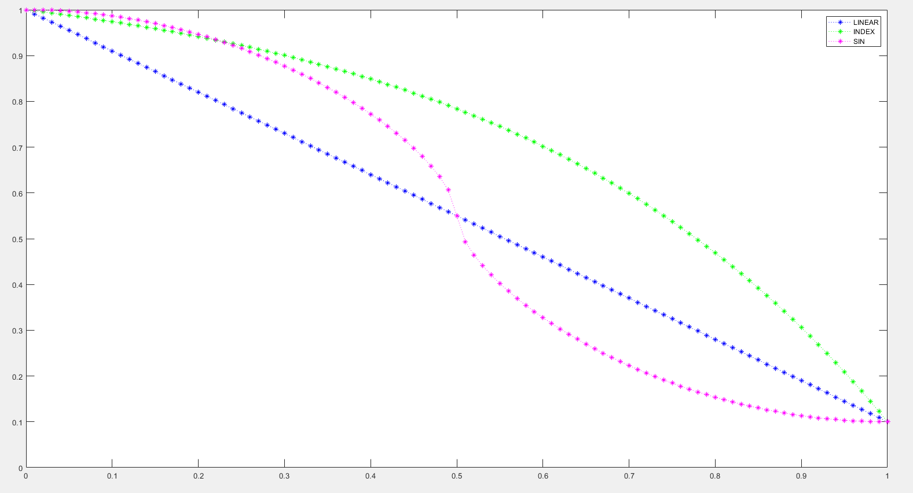
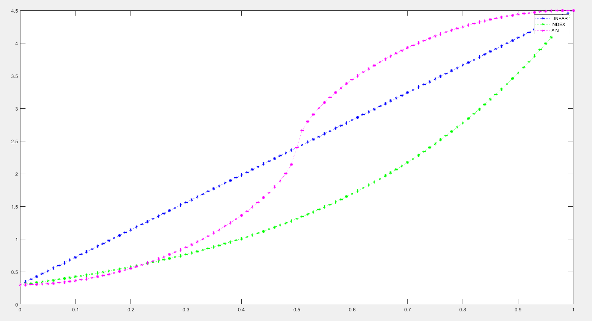

# /madparticle Command Guide

This chapter contains all the important information related to the `/madparticle` command.

<div style={{
    backgroundColor: 'transparent',
    border: '3px solid #f07020',
    borderRadius: '1rem',
    padding: '1rem',
    color: '#f07020'
  }}>
<div>

During **TeaCon 2023**, visitors can use the `/mp_demo` command to execute a MadParticle command in a specific area. For server security and smooth touring experience, various parameters of `/mp_demo` may have additional restrictions. Here is a detailed list of the limitations:

- The maximum value for `liftTime` is 100.
- The maximum value for `amount` is 10.
- The range for `spawnSpeed` and `speedDiffuse` is -1 to +1. Note that when these parameters exceed the specified limits, the command execution process will be interrupted directly without any red warning message.
- The maximum value for `bounceTime` is 3.
- The range for `horizontalRelativeCollisionDiffuse` and `verticalRelativeCollisionBounce` is -2 to +2.
- The range for `friction` and `afterCollisionFriction` is 0 to 1.
- The range for `gravity`, `afterCollisionGravity`, `xDeflection`, `xDeflectionAfterCollision`, `zDeflection`, and `zDeflectionAfterCollision` is -0.5 to +0.5.
- The range for `rollSpeed` is -0.5 to +0.5.
- The range for `horizontalInteractFactor` and `verticalInteractFactor` is -2 to 2.
- The range for `r`, `g`, and `b` is 0 to 10.
- The range for `beginScale` and `endScale` is 0 to 5.

</div>
</div>

---

:::caution

Incorrect command parameters may make your client very laggy to handle the large number of particles, even causing the client to crash, requiring the uninstallation of the mod and removal of the corresponding Command Block. In more severe cases, your world may become unplayable.

:::

:::caution Attention

- The `/madparticle` and `/mp` commands are almost identical in terms of their theoretical effects, except for the following:
  - `/madparticle` uses the default Minecraft command execution system, which means higher performance consumption but no unexpected execution results.
  - `/mp` uses a simplified command execution process, which means lower performance consumption but may result in unexpected execution results, including but not limited to game crashes, invalid permissions for this command, etc. Also, the `whoCanSee (entity)` parameter will be ignored and forced to be `@a`.
  - `/mp` has limited compatibility with `/execute`, specifically supporting only `at [target selector]` and not supporting other parameters, like `run` or `as`.
  - If other commands produce unexpected results during execution (including possible failures without prompts), please check if the command starts with `mp■` or contains `■mp■` (■ represents a space). If so, try to avoid using that command: MadParticle uses these two characteristics to detect and simplify command execution.
  - To prevent ordinary players from causing lag, the execution permission for `/madparticle` and `/mp` commands is set to level 2.

:::

Here are all the parameters and brief descriptions of the `/madparticle` command. The parameter names may slightly differ in the game. Don't worry, you don't have to manually write such a long command.

```
/madparticle /mp
// Basic information
targetParticle (Particle) // Particle to mimic
spriteFrom (MadParticle.SpriteFrom) // Sprite selection method (random | change over time)
lifeTime (int) // Duration
alwaysRender (InheritableBoolean) // Ignore maximum particle distance (vanilla default is 32 blocks)
amount (int) // Number of particles generated per command execution
// Generation parameters
px, py, pz (double) // Generation position
xDiffuse, yDiffuse, zDiffuse (double) // Generation position deviation
vx, vy, vz (double) // Initial velocity
vxDiffuse, vyDiffuse, vzDiffuse (double) // Velocity deviation
// Motion parameters
collision (InheritableBoolean) // Collide with blocks
bounceTime (int) // Maximum collision count
horizontalRelativeCollisionDiffuse, verticalRelativeCollisionBounce (double) // Horizontal diffusion and vertical bounce during collision
friction, afterCollisionFriction (float) // Friction and friction after collision
gravity, afterCollisionGravity (float) // Gravity and gravity after collision
xDeflection, zDeflection, xDeflectionAfterCollision, zDeflectionAfterCollision (float) // X and Z deflection forces
rollSpeed (float) // Rotation speed
interactWithEntity (InheritableBoolean) // Affected by player movement
horizontalInteractFactor, verticalInteractFactor (double) // Horizontal and vertical interaction factors
// Display parameters
renderType (renderType) // Rendering mode
r, g, b (double > float) // Color
bloomFactor (float) // Bloom intensity
beginAlpha, endAlpha (float) // Initial and final opacity
alphaMode (MadParticle.ChangeMode) // Opacity change mode (linear | exponential | sine)
beginScale, endScale (float) // Initial and final scale
scaleMode (MadParticle.ChangeMode) // Scale change mode (linear | exponential | sine)
// Additional content
whoCanSee (entity) // Players who can see the particle
meta (CompoundTag) // Meta command area
expireThen (madParticle command) // Generate new particle when the particle disappears

```

---

Here is a detailed explanation of the parameters. You need to understand the meaning and value range of each parameter.

:::tip

For users who are not familiar with the options, it is recommended to pay attention to the "Reference" section for each parameter.

:::

:::caution Attention

- The reference values provided below have not been cross-verified and may not be accurate.
- When the parameters of type Vec3 (coordinates) are integers, please add `.0` at the end as needed, instead of just entering the integer part. Integers are CenterCorrected by default, which means they will be adjusted by +0.5.
- `InheritableBoolean` is a wrapper for `bool`, and besides `TRUE` and `FALSE`, it can also be set to `INHERIT`. For more details, see the section on `expireThen` below.
- The term "undefined behavior" mentioned below typically does not cause serious consequences such as game crashes or errors, but it may result in unexpected particle behavior.

:::

## targetParticle

Determines the particle you want to mimic. MadParticle (referred to as MP) will attempt to obtain the texture from the specified particle and apply it. Some particles may not be supported by MP, and even if you enter the command, particles will not be generated.

## spriteFrom

Determines how MP selects the texture when mimicking the particle. `RANDOM` means randomly selecting a texture, while `AGE` means the texture of the particle will change over time, similar to the "cloud" particle (the white smoke when entities die).

## lifeTime, alwaysRender, amount

`lifeTime` determines the duration of the particle in ticks. There is a random variation of ±10% when generating the particle.

:::info Reference

In general, you should keep this value (within the range of expected effects) as small as possible to reduce the total number of particles and minimize frame rate loss. If you need to create long-lasting particles, you should also control the total number of particles by adjusting `amount`.

:::

`alwaysRender` determines whether the particle ignores the maximum particle distance and the particle level set in the game options. In the original Minecraft version, the maximum particle distance is 32 blocks. In [Extinguish](https://www.curseforge.com/minecraft/mc-mods/extinguish-by-uss_shenzhou), this value is increased to 64 blocks. For more information, see [Max Particle Distance](config#maximum-particle-distance).

:::info Reference

In general, it is recommended to keep this value as `FALSE`, as setting it to `TRUE` may cause unexpected frame rate loss.

:::

`amount` determines the number of particles generated per command execution.

:::info Reference

In general, you should keep this value (within the range of expected effects) as small as possible to reduce the total number of particles and minimize frame rate loss. If the particles generated in each tick have too large spacing, you can increase `amount` and also consider increasing `Diffuse` and `size`.

:::

## x, y, z and vx, vy, vz

x, y, z specify the position where the particle is generated. You can use the `~` or `^` symbol, similar to specifying coordinates in the vanilla.

vx, vy, vz specify the initial velocity of the particle along each axis. Generating particles with diagonal velocities may require some knowledge of trigonometric functions.

> In the future, in the GUI tool that will be introduced, we may include assistance for writing direction vectors.

:::caution Note

Note: The units for vx, vy, vz are m/tick, which means the entered values may not align with general intuition.

:::

## xDiffuse, yDiffuse, zDiffuse

Determines the range within which the particle will be generated.

:::info Reference

For example, if `x` is 100 and `xDiffuse` is 5, the particle will be randomly generated within the range of x = 95 to 105. When writing a command for the first time, it is recommended to start with a small value or even `0.0` to check if the particle behavior matches your expectations.

:::

## vxDiffuse, vyDiffuse, vzDiffuse

Determines the range of velocities for the generated particles. Note that the unit is m/tick, so large values are generally not necessary.

:::info Reference

For example, if `vx` is 0.2 and `vxDiffuse` is 0.02, the particles generated may have velocities on the x-axis ranging from 0.18 to 0.22. If you want to achieve a fireworks-like effect (i.e., radial expansion from the center), starting with `vx=0.0` and `vxDiffuse=0.3` is a good attempt. When writing a command for the first time, it is recommended to start with a small value or even `0.0` to check if the particle behavior matches your expectations.

:::

## collision, bounceTime

`collision` determines whether the particle will collide with blocks.

`bounceTime` determines the maximum number of collisions the particle can undergo before no longer being subject to collision detection.

:::info Reference

In general, it is recommended to keep this value below 4, except when specifically trying to create a bouncing effect.

:::

:::tip

It is worth noting that due to differences between particle textures, collisions may not behave as expected. It is normal for particles to get stuck in the ground or disappear when they hit the ceiling (in terms of program execution).

:::

## horizontalRelativeCollisionDiffuse, verticalRelativeCollisionBounce

`horizontalRelativeCollisionDiffuse` determines the range of horizontal diffusion when a collision occurs.

:::info Reference

The baseline value is 1, indicating that up to 100% of the kinetic energy is used for horizontal diffusion, creating an effect similar to completely elastic collisions.

:::

`verticalRelativeCollisionBounce` determines the range of vertical diffusion when a collision occurs.

:::info Reference

The baseline value is 1, indicating that up to 100% of the normal velocity is used for vertical bouncing, creating an effect similar to completely elastic collisions.

:::

:::tip

Here, "horizontal" and "vertical" are relative to the collision surface.

:::

## friction, afterCollisionFriction

`friction` determines the magnitude of the velocity decrease when the particle is in motion.

`afterCollisionFriction` determines the new friction value after a collision with another object. If you don't want to change the friction after collision, you can fill in the same value as `friction`.

:::info Reference

The friction coefficient for normal walking is 0.6, and on ice, it is 0.98.

:::

:::tip

Friction affects particle velocity exponentially, meaning the velocity is reduced by `vx = vx * friction` per tick.

Values greater than 1 are undefined behavior.

:::

## gravity, afterCollisionGravity

`gravity` determines the strength of the gravitational force acting on the particle during its motion.

`afterCollisionGravity` determines the new gravity value after a collision with another object. If you don't want to change gravity after collision, you can fill in the same value as `gravity`.

:::info Reference

A gravity value of 0.01 will result in a slow descent, while values between 0.02 and 0.03 will approximate normal falling behavior. Higher values will cause objects to fall rapidly (~~Aristotle would be thrilled~~).

Unlike friction, gravity acts linearly at 0.04 times on the particle.

:::

## xDeflection, zDeflection, xDeflectionAfterCollision, zDeflectionAfterCollision

`xDeflection, zDeflection` determine the deflection force acting on the particle during its motion in the horizontal direction. It acts linearly, similar to horizontal gravity.

`xDeflectionAfterCollision, zDeflectionAfterCollision` determine the deflection force acting on the particle after a collision.

## rollSpeed

Determines the rotational speed of the particle. Like `lifeTime`, it has a random error of up to ±10%. When `rollSpeed` is not 0, the particle will have a random initial rotation upon creation.

:::info Reference

A value of 1 represents a 360° rotation per tick.

If you want a particle with a random initial rotation but no subsequent rotation, you can set this value to a very small non-zero value.

:::

## interactWithEntity, horizontalInteractFactor, verticalInteractFactor

`interactWithEntity` determines whether the particle will be lifted when a player passes by.

`horizontalInteractFactor` determines how much horizontal velocity the particle gains when disturbed. The baseline value is 1, meaning it can obtain the same horizontal speed as the player.

`verticalInteractFactor` determines how much vertical velocity the particle gains when disturbed. It calculates the maximum value of the geometric mean of the player's vertical and horizontal velocities, and then multiplies it by this factor.

:::info As a reference

The disturbance factors for particles in [Extinguish](https://www.curseforge.com/minecraft/mc-mods/extinguish-by-uss_shenzhou) are 0.3 for horizontal and 0.12 for vertical.

:::

:::tip

Due to data differences between the client and server data, the disturbance effect produced by a local player may vary in intensity compared to other players.

:::

## renderType

Determines the rendering mode of the particle.

:::info Reference

If you are unfamiliar with this option, it is recommended to choose `PARTICLE_SHEET_TRANSLUCENT`, which allows the particle to have transparency. `PARTICLE_SHEET_OPAQUE` ignores the particle's transparency.

MP has some special modifications to allow a wider range of color settings in certain cases (see the following). We have made modifications for common rendering/optimization mods, but there may still be potential compatibility issues. If you encounter any problems, please provide feedback promptly.

:::

:::danger

**Do not choose `CUSTOM` unless you understand it.**

:::


## r, g, b

Determines the color changes to be applied to the particle texture. Values less than 0 are treated as 0, and there is no hard upper limit.

:::info Reference

`(1,1,1)` represents rendering the particle based on the original colors of the texture.

`(3,1,1)` represents tripling the red component of the texture, while keeping the other color components unchanged. It's worth noting that in most cases, the final result is limited to within 255. For example, `(123,123,123) × (3,1,0.4) = (255,123,49)`.

:::


## bloomFactor

Determines the modification applied to the particle's bloom.

:::info Reference

This is an interdependent feature that requires the installation of ***[Shimmer](https://github.com/Low-Drag-MC/Shimmer)*** to work. The value can be 0 or 1. 0 means no bloom, and 1 means normal bloom.

:::

:::caution Note

***Shimmer*** is not compatible with ***Optifine***.

If you have installed Iris or Oculus and enabled shaders, particle rendering will be automatically downgraded for compatibility. Particles generated before enabling shaders will not be rendered.

Similarly, bloom will not be applied, which means that bloom cannot be enabled when shaders are active on any platform.

Similarly, the upper limit for the coefficients of r, g, and b is 1. Entering values greater than 1 will have no effect. This means that you may not be able to achieve the desired color changes for the texture.

Shimmer does not currently have a version for 1.19.4.

:::

## beginAlpha, endAlpha, alphaMode

`beginAlpha` determines the opacity of the particle when it is generated.

`endAlpha` determines the opacity of the particle when it disappears. If no opacity change is required, enter the same value as `beginAlpha`. The range is limited to 0-1.

`alphaMode` determines how the opacity of the particle changes. `linear` indicates linear change, `index` indicates exponential change, and `sin` indicates sine change. If no opacity change is required, enter `linear`.

:::info Reference

1 represents a fully opaque particle, and 0 represents a fully transparent particle.

For example, if `beginAlpha` is 1 and `endAlpha` is 0.1 (i.e., a particle that gradually fades), and the particle's lifespan is 100 ticks (5 seconds), the three types of change mode curves can be simulated as follows:



:::

:::tip

o highlight the differences from other modes, the base for exponential change is set to 10.

The sine change uses the `sin` function raised to the power of `3/5` to emphasize the difference. It uses table lookup and linear interpolation for simplified calculations.

:::

## beginScale, endScale, scaleMode

`beginScale` determines the scale value of the particle when it is generated.

`endScale` determines the scale value of the particle when it disappears. If no scale change is required, enter the same value as `beginScale`.

`scaleMode` determines how the scale of the particle changes. The three options are the same as the alpha change modes mentioned above.

:::info Reference

As a reference: 1 represents the particle at its original size. Larger values will make the particle larger.

For example, if `beginScale` is 0.3 and `endScale` is 4.5 (i.e., a particle that continuously grows), and the particle lifespan is 100 ticks (5 seconds), the three change mode curves can be simulated as follows:



:::


---


The following content is optional, not mandatory.

## whoCanSee

> Thanks to `@MalayP` for the suggestion.

Determines which players will receive the particle data. Like the original command, you can use entity target selectors. If not specified, the particle will be sent to all players in the dimension by default.

## meta

This is a meta-command area presented as a `CompoundTag`. You can fill in the corresponding key-value pairs as needed.

The meta-command area is designed to ensure compatibility and expandability for future updates.

:::info

The currently available key-value pairs and their functions are:

- `"tada": 1` marks this as a Tada command, thus the player's hand position needs to be calculated when generating particles.

:::

## expireThen

> Thanks to `@MalayP` for the suggestion.

Determines what particle the current particle will transform into when it disappears. It must be preceded by a specified `whoCanSee` and followed by a complete `madparticle` command. This means that a whole chain of MP commands can be extended in a nested manner, where a parent particle can have a sequence of child particles.

:::info

- The maximum character length allowed in the chat window is 256, which means that nested commands are not supported. The maximum length allowed in command blocks is 32500, so theoretically you can nest about 161 sub-particle commands (a total of 162 commands, calculated at 200 characters per command). However, overly complex nesting may result in large network packets, excessive memory usage, and other potential issues.

---

- **Unlike the first `mp` command that generates the parent particle, in the child particle commands, you can use an equals sign `=` (for numerical parameters) or `INHERIT` (for boolean (replaced by enumerations) and enumeration parameters) at certain parameter positions, which means that the value of this parameter in the child particle will inherit from its parent particle.**
- The equals sign `=` is similar to the usual `~` and `^`, but the difference is that the equals sign `=` has a simple highest priority, and its presence will override all other numbers under this parameter. Therefore, not only does `=` indicate that "this parameter inherits from the parent particle", but `=-1=`, `3=`, `==1==2==3==` are also accepted and have the same meaning. However, this practice is not recommended.
- Please do not use `=` and `INHERIT` (even if they are not marked in red) at the parameter positions of the top-level parent particle, as this may cause unexpected behavior.
- The `amount` parameter of the child particle will be ignored and remains as 1. We also recommend that you enter 1 instead of other values (although there will be no other problems).
- The `whoCanSee` parameter of the parent particle will be ignored, and the `whoCanSee` of the last child particle will be used.

:::


> The following parameters are available for inheritance: `✅` means they can be inherited using `=` or `INHERIT`, `❌` means they cannot be inherited, and you must explicitly specify the value, `🔘` means their value will be ignored.
>
> ```
> ... expireThen
> // Basic Information
> ❌ targetParticle (Particle) // The particle to mimic
> ✅ spriteFrom (MadParticle.SpriteFrom) // Texture selection mode (Random | Changes over time)
> ✅ lifeTime (int) // Duration
> ✅ alwaysRender (InheritableBoolean) // Whether to ignore the maximum particle distance (default: 32 blocks)
> 🔘 amount (int) // Number of particles generated per tick <Not available for child particles to prevent exponential growth>
> 
> // Generation-related
> ✅ px, py, pz (double) // Generation position
> ❌ xDiffuse, yDiffuse, zDiffuse (double) // Generation position deviation
> ✅ vx, vy, vz (double) // Initial velocity
> ❌ vxDiffuse, vyDiffuse, vzDiffuse (double) // Initial velocity deviation
> 
> // Motion-related
> ✅ collision (InheritableBoolean) // Whether to collide with blocks
> ✅ bounceTime (int) // Maximum number of collisions
> ✅ horizontalRelativeCollisionDiffuse, verticalRelativeCollisionBounce (double) // Horizontal diffusion/vertical bounce coefficient during collision
> ❌ friction, afterCollisionFriction (float) // Friction, friction after collision <Ambiguous and not allowed to be inherited>
> ❌ gravity, afterCollisionGravity (float) // Gravity, gravity after collision <Ambiguous and not allowed to be inherited>
> ❌ xDeflection, zDeflection, xDeflectionAfterCollision, zDeflectionAfterCollision (float) // x,z deflection force <Ambiguous and not allowed to be inherited>
> ✅ rollSpeed (float) // Rotation speed
> ✅ interactWithEntity (InheritableBoolean) // Whether it is affected by player movement
> ✅ horizontalInteractFactor, verticalInteractFactor (double) // Horizontal disturbance factor, vertical disturbance factor
> 
> // Display-related
> ❌ renderType (renderType) // Rendering mode
> ✅ r, g, b (double > float) // Color
> ✅ bloomFactor (float) // Bloom intensity
> ❌ beginAlpha, endAlpha (float) // Initial/ending opacity <Ambiguous and not allowed to be inherited>
> ✅ alphaMode (MadParticle.ChangeMode) // Opacity change mode (Linear | Exponential | Sine)
> ❌ beginScale, endScale (float) // Initial/ending scale <Ambiguous and not allowed to be inherited>
> ✅ scaleMode (MadParticle.ChangeMode) // Scale change mode (Linear | Exponential | Sine)
> 
> // Additional Content
> 🔘 whoCanSee (entity) // Players who can see this particle <Not available for child particles>
> ❌ meta
> expireThen ...

