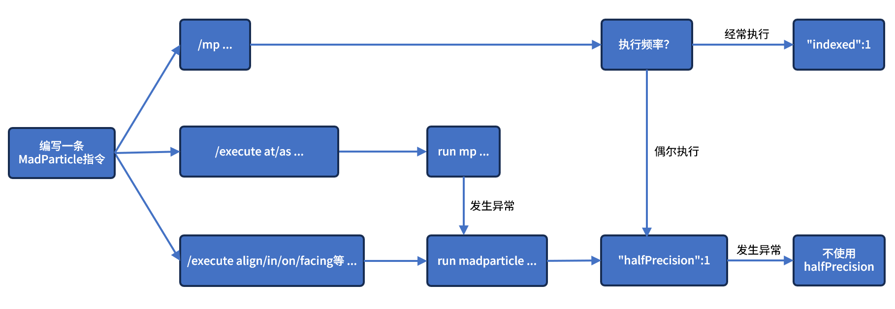

---

id: meta
title: Meta Command Parameter Guide
hide\_table\_of\_contents: false

---

# Meta Command Parameter Guide

:::caution

Some content on this page may have been translated by AI. The translated pages may be behind the latest version.

:::

The `meta` parameter is a meta command section presented as a `CompoundTag`. It is designed to ensure compatibility and extensibility in future updates.

You can selectively fill in content based on the descriptions of the flags below, your needs, and the current version.

:::info

The following values provide recommended ranges. Although you may be able to enter values outside the recommended ranges in-game, we do not recommend doing so. Entering values outside the recommended ranges is undefined behavior.

:::

---

## Tada (Celebration) Flag

> Available in version: 0.3.+
>
> Format: `"tada":1`
>
> Value type: Boolean (enter `0` or `1`)

Indicates that this is a celebration (tada) command. The client must calculate the player’s hand position and apply the corresponding offset when generating particles.

## Pulse

> Available in version: 0.4.19+
>
> Format: `"pulse":1`
>
> Value type: Boolean

Sets the celebration mode to pulse. After emitting particles once, the player must release the right mouse button before emitting particles again.

---

## Mathematical Expressions: dx, dy, dz

> Available in version: 0.4.+
>
> Format: `"dx":"<mathematical expression f(t)>"`
>
> Example: `"dy":"0.2*sin(3t)+0.5*t"`
>
> Value type: String

You can fill in a function expression with `t` as the independent variable to achieve advanced control over the per-tick increments of particles along the X, Y, and Z axes. Because directly controlling absolute particle coordinates greatly affects command reusability, if you want a particle’s trajectory along the X-axis to be `F(t)`, you need to fill in its **derivative `f(t)`** to eliminate the influence of absolute coordinates.

Similarly, to remove the effect of different particle lifetimes on command reusability, **`t` is in the range `[0,1]`** (corresponding to the particle’s generation to disappearance), and in practice it is scaled according to the particle’s lifetime.

:::caution

If you specify dx, dy, or dz here:

* The corresponding `gravity`, `xDeflection`, and `zDeflection` will be disabled, and `friction` will be overridden;
* The `interactWithEntity` (interaction with players) effect will stack;

:::

:::info

Considering that complex expressions may impact performance, the current calculation method is:

1. If dx, dy, or dz is specified, particle object initialization is delegated to another thread, with each command running in its own thread to initialize a batch of particles;

    1. The initialization process includes precomputing dx, dy, and dz: substitute a total of 101 `t` values between 0.00–1.00 (or, if the particle lifetime is less than 100, take the particle lifetime + 1) into the provided expression to compute corresponding values for lookup;
2. After a batch of particles is initialized, they are added to the world at the appropriate time;
3. When particles move, they read from the saved dx, dy, dz arrays and, using a method similar to `alphaMode`’s `SIN` mode, use lookup tables and linear interpolation to obtain the corresponding values.

The benefit of this approach is minimizing the impact on MSPT, but the current drawback is that it consumes relatively more memory resources.

:::

### Supported Operators

The following list includes all supported operators:

* `+`, `-`, `*`, `/`: addition, subtraction (negation), multiplication, division;
* `^`: exponentiation;
* `%`: modulus (remainder);

As shown in the example, you can omit the multiplication sign where appropriate.

### Supported Constants

The following list includes all supported constants:

* `pi` or `π`: π (pi), `3.14159265358979323846`;
* `e`: Euler’s number, `2.7182818284590452354`;
* `φ`: Golden ratio, `1.61803398874`;

### Supported Functions

The following list includes all supported functions:

* `abs`: absolute value;
* `sin`, `cos`, `tan`: sine, cosine, tangent (radians);
* `asin`, `acos`, `atan`: arcsine, arccosine, arctangent;
* `sinh`, `cosh`, `tanh`: hyperbolic sine, hyperbolic cosine, hyperbolic tangent;
* `sqrt`, `cbrt`: square root, cube root;
* `floor`, `ceil`: largest integer ≤, smallest integer ≥;
* `exp`: exponentiation with base e;
* `log`, `log10`, `log2`: natural logarithm (base e), common logarithm (base 10), logarithm (base 2);
* `signum`: sign function;

### Scientific Notation

Technically supported, but we can’t think of any particle use case requiring scientific notation…

---

## Lifetime Variance

> Available in version: 0.4.+
>
> Format: `"life":"<percentage variance>"`
>
> Example: `"life":"20"`
>
> Value type: Integer (`1`\~`99`)

Overrides the default 10% lifetime variance when generating particles. In the example, it is 20% lifetime variance.

---

## Disappear on Collision

> Available in version: 0.4.3+
>
> Format: `"disappearOnCollision":"<number of collisions to trigger>"`
>
> Example: `"disappearOnCollision":"2"`
>
> Value type: Integer (greater than `0`)

Causes the particle to disappear immediately upon reaching the specified number of collisions. In the example, the particle disappears on its second collision.

You can use this feature in combination with `expireThen` to make a particle transform into another particle upon collision.

---

## Rewind

:::info

This is a `long-term experimental` meta command flag, which means it may be changed or removed in the future.

:::

> Available in version: 0.4.7+
>
> Format: `"tenet":1`
>
> Value type: Boolean

Performs one round of precomputation when generating the particle, then adds it to the world and plays it back in reverse along the precomputed trajectory.

## Precompute (Forward)

> Available in version: 0.4.21+
>
> Format: `"preCalculate":1`
>
> Value type: Boolean

Performs forward precomputation when generating the particle, then adds it to the world. Effectively reduces main-thread load from collision calculations.

:::caution

If you specify Rewind or Precompute:

* Rewind logic already includes Precompute, so if both flags appear then Rewind takes priority.
* `interactWithEntity` (interaction with players) will be disabled;
* The particle cannot react to terrain changes made after precomputation.

:::

:::danger

Currently, compatibility of Rewind and Precompute with child particles may be poor.

:::

:::danger

Precompute is only suitable for scenarios with a small number of particles. In scenarios with many particles, it may not be effective because the CPU becomes saturated.

:::

---

## Light (Brightness)

:::info

This is a `testing-phase` meta command flag, which means it has not undergone complete testing and may behave unexpectedly in some cases (e.g., when using shaders).

:::

> Available in version: 0.4.9+
>
> Format: `"light":"<mathematical expression f(t)>"`
>
> Example: `"light":"15t"`
>
> Value type: String

Similar to dx, dy, dz, you can fill in a function expression with `t` as the independent variable, also using the precompute–lookup–interpolation method. During calculation, the function value will be floored and clamped between 0 and 15.

:::caution

Particles played in reverse (i.e., `"tenet"`) will not honor the specified light changes.

:::

---

## Compressed Transmission

> Available in version: 0.7.2+
>
> Format: `"halfPrecision":1`
>
> Value type: Boolean

Uses half-precision floating-point numbers to transmit certain parameters. Typically saves about 28% of server bandwidth without noticeable visual difference.

---

## Indexed Transmission

> Available in version: 0.8.1+
>
> Format: `"indexed":1`
>
> Value type: Boolean

Uses an index number to transmit nearly the entire command. The index, a randomly generated integer, represents the entire command and can greatly reduce server bandwidth usage.

:::info

When the client executes a command for the first time, it will first query the server for the corresponding command text to cache. Therefore, the first execution of a given command may incur triple the latency.

:::

:::caution

Indexed Transmission and Compressed Transmission are not compatible. When both are present, Indexed Transmission will override Compressed Transmission.

:::

:::tip

If you are unsure which optimization parameters to use, here is a simple diagram to help you choose the prefix and transmission method:

:::
